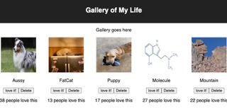

# Weekend-React-Gallery

## Description

This application is a gallery style page that allows the me  to share pictures. Users can click on the image to add likes to that image

## Screenshots

## Built With

  

## Getting Started

Fork and clone the repo onto your computer

### Prerequisites

What do I need to install before I can run your project

### Installation

1. npm install
2. npm run server 
3. npm run client

## Contacts

  